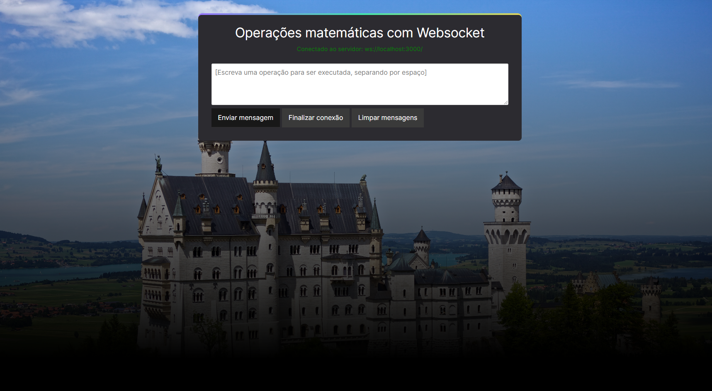

# WebSocket com NodeJS

Projeto construído como atividade prática na disciplina de NodeJS, no curso de Desenvolvimento Web FullStack (PUC Minas)

## ⚒️ Tecnologias
- HTML
- CSS
- Javascript (NodeJS, Express e WebSocket)

## ✅ Objetivo
- Reforçar o conhecimento de HTML e CSS responsivo
- Aplicar o conhecimento em NodeJS com requisições persistentes